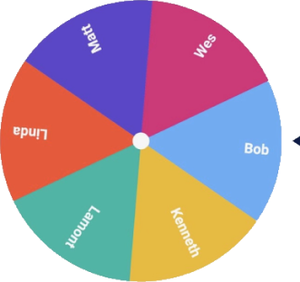

# Crypto Giveaway Wheel Whitepaper (Draft)

 
 

 
 
      
## Crypto Giveaway Wheel
#### Free Crypto For All

 
 

## Core Team

 

Jim Lynch
jim.lynch@cryptogiveawaywheel.org

Linda Chun
linda.chun@cryptogiveawaywheel.org

Christian Stevenson
christian.stevenson@cryptogiveawaywheel.org

Wes Sapone
wes.sapone@cryptogiveawaywheel.org

Ibrahim Abouzeid
ibrahim.abouzeid@cryptogiveawaywheel.org

 
 

## Abstract

Every time our EthBuildersNYC meetup group meets nowadays someone says, "aww, I wish we had finished that crypto giveaway wheel project so that we could do a crypto giveaway right now!".

The Crypto Giveaway Wheel is a simple browser application meant to bring people together and continuously make everybody a little bit more connected, a little bit more aware, and a little bit more wealthy.

This document lays out the philosophical underpinnings, technical foundations, and economic mechanisms of the Crypto Giveaway Wheel project.

We would like to thank the following reviewers, whose contributions and feedback made this project possible:

- Amal (Consensus)
- Anthony (Consensus)
- Ken (EthBuildersNYC)
- Yuling (Polygon)
- 

 
 

## Rationale

Blockchain technology has opened the door to cryptocurrencies and smart contracts, and the Crypto Giveaway Wheel is a dApp that marries the two in a fun, affordable, and easy-to-operate token distribution platform.

The Hack Money hackathon challenged us to use blockchain to create a world with a "freer and fairer finance".

So we asked ourselves, "How do we eliminate poverty? How do we close the widening wealth gap? How do we encourage people to help and learn from each other?". While these are lofty goals that won't be solved overnight, we think the Crypto Giveaway Wheel is a step in the right direction. 

 
 

## Open, Plug And Play System

This dApp was built for our EthBuildersNYC meetup group, but we want to open it up to be used by _any_ meetup group to run crypto giveaways for its members.

We plan to allow users to sign up as the admins for their own group. These users would be able to customize their own unique url for their members to use.

For example: https://cryptogiveawaywheel.org/ethbuildersnyc

 
 

## Rewards People For Community Involvement And Learning

The key difference between the Crypto Giveaway Wheel and a universal basic income check is that with our dApp users are forced to show up an opt in for every payment. The Crypto Giveaway Wheel rewards those who are curious, those who are eager to learn, and those who get involved in community groups near them (or online). 

The world outside of blockchain is very unfair, and some people are at an unnecessary disadvantage because of their finances, skin color, sexual orientation, or countless other reasons... 

But for the Crypto Giveaway Wheel, everyone can escape all those unfairnesses. All you have to do is show up and say, "Hey friends, I'm here!", and you've got a fair shot at getting the grand prize _and_ a gaurentee that you'll get at least some free crypto token(s).

 
 

## Trustless, Open, And Fair

Another reason why we chose to built this application on the blockchain (as opposed to a tranditional frontend-backend-database architecture) was that we wanted everything to be fully open and trustless. When all the logic is written in public, immutable smart contracts nothing can be hidden, and the users know exactly what they are getting.

Even the randomly chosen winner, a feature added for some pizzaz and excitement, is fairly chosen by a _verifiably random function._ 

With the Crypto Giveaway Wheel we want to make the world a better place, one meetup event at a time. 

 
 

## No Fees, Just Free Money

We want to offer the users a game experience where there is not just a low bar to entry- it's NO bar to entry.

 
 

Inspired by the fantastic user experience of Decentraland's Polygon Mana, we too plan to completely pay for the users' gas costs so the sponsor contributions, participants registrations, and willings withdrawals all require only a signature confirmation from your wallet with no payment necessary.

 
 

Of course the underlying transactions _do_ cost gas, and if the users are not paying the cost then we are! We plan to fund these costs out of the 5% "dev share" collected from each pot.

We also plan to minimize our incurred costs by building in support for multiple layer 1 and layer 2 chains such as NEAR and Polygon.  

We plan to build up a small bankroll for the dev account with any hackathon winnings for this project and / or contributions from core team members. This should give us some runway to hold giveaways and work out any kinks while we develop a profitable and sustainable operation that continues to be completely free for the users.

 
 

## Sponsors
#### Donating Knowledge To Our Brains And Crypto To Our Wallets

While we cover the gas costs, the "pot" that is distributed among the grand prize winner, participation prize winners, and dev team is funded by the "sponsor".

The sponsor is normally a representative from some company or organization trying to get their message out- a new product, a hiring campaign, an upcoming event, etc...

Ideally, though not required, a sponsor representative should be present at the event (either in person or remotely). This facilitates some discussion about the sponsored topic and allows any participants' questions to be answered by an expert on the subject.

The sponsors are core drivers of user engagement, and they ensure every meeting has the two promises we make to users: free crypto for everyone and interesting things to talk about with your fellow community members.

 
 

## The Wheel
#### Some Spice Is Nice

Humans are extremely intrigued by randomness. It is a core element of what makes many games not onlyt fun the first time, but for an infinite number or replays as well- and in any given game _anything_ can happen.

While some may argue that the wheel itself is a unnecessary gimmick, we believe that the wheel overall improves the user experience by adding an element of excitement, suspense, and surprise although it is important for everyone to recognize that the wheel is _not_ the source of randomness, but just an interesting way to visualize the user selection on the frontend.

 
 

## Payout Breakdown

The sponsor donates some of their desired cryptocurrency to "the pot". When the wheel is spun evryone is assigned a portion of the pot which they can withdraw by clicking the "claim winnings" button. But exatly how much is assigned to each user? We are not completely stuck on these proportions, but this is what we are currently planning for the breakdown:

  - Grand Prize Winner Participant: 25% of the pot

  - Dev Team: 5% of the pot

  - Other participants: Equally divide 70% of the pot

  For example, suppose there is 0.1 eth in the pot and 6 participants.
  
  - The grand prize winner would claim 0.025 eth.
  
  - Each of the other 5 recipients can claim 0.014 eth.

  When the admin call the "end event" function all the remaining eth is sent to the "dev wallet". This ensures that no eth is left "stuck in the contract".
  
   
  #### Payout Breakdown With NFTs
  
  Suppose a Decentraland wearable creator wants to distribute his or her new shirts to users via the Crypto Gievaway Wheel. With this model, there is a "grand prize NFT" (a "legendary" shirt) and a participant prize (every oneelse else gets a less rare "uncommon" shirt).
  
  The sponsor chooses a maximum amout of uncommon NFTs to give away. As users register the system calculates the 5% dev share and reserves 5% of the uncommon shirts to be sent to the dev wallet when the event is closed.
  
  Every registered user must get an NFT, so once enough users have registered that the number of allocated uncommoon shirts have all been assigned then registration ends. New users who try to join will receive an error message that registration is full. 

 
 

## All The Crypto, All The Networks! 

We want to start small and interate to all the things! 

First, we will support distributing ether on the ethereum network.

We plan to support other layer 1 networks (such as Binance or NEAR) and also layer 2 networks (such as Polygon).

Ultimately, we want to support a system where the sponsors can contribute _any_ cryptocurrency **or NFT** or _any_ network!

 
 

## Security Considerations

Security is a huge concern in software development and especially in blockchain software development!

Here are a few things we are planning to do to make our system robust and hack-proof.

- Making sure to have modifiers to lock down admin-only, sponsor-only, and recipient-only callable public functions.

- Using a "Pull Payment" strategy for distributing funds to users.

- Putting Reentrancy gaurds on our functions.

- Using OpenZeppelin's _Upgradable_ patten so we can fix any bugs that may come up.

 
 

## Legal Considerations

This began as a fun way to airdrop some crypto to the people who came out to our meetup events, but it could grow into a massive money-distributing machine, and we don't want to break any laws in the proecss of running it.

Before we deploy this live we plan to seek legal advice on at least these things:

- Do we need to sent our recipients 1099 forms at the end of the year to report their winnings as income?

- Do we need to do KYC (know your customer) verification on participants?

- Do we need to somehow prove that people are not part of some terrorist organization?

- Is this considered gambling? (note that there is no wager being made)

- Are there specific states, countries, or territories whose citizens we cannot allow to participate?

 
 

## Special Thanks

Special thanks to all the people who have helped us build this project and inspired us. The blockchain world is a great community in a fast-moving industry, and we hope our dApp will only accerate and expand people's interest and adoption of crypto technologies.

 
 

  
